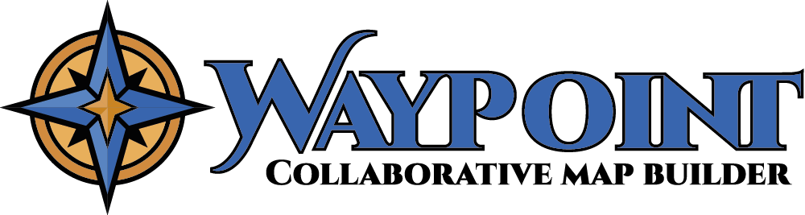

# WayPoint - Collaborative Map Builder

  

<strong>🌍 English version</strong>

WayPoint - Map Builder is a progressive web application (PWA) designed to let users collaboratively create, annotate, and share custom interactive maps in real time.

This project serves as a certification project for a full-stack web/mobile developer certification (RNCP 5).

> 📅 **Open-source release scheduled for July 2025.**

---

## 🎯 Project Goal

WayPoint enables gamers, content creators, and groups to collaboratively build, customize, and share interactive maps using personalized images (e.g., game maps).

---

## 👥 Target Users

- Gamers marking zones, bosses, treasures, or POIs on game maps
- Content creators sharing custom maps
- Player groups collaboratively annotating maps

---

## 🛠 Core Features

- 📤 Custom map image uploads
- 📌 Points of Interest (POI) with details (coordinates, description, icons, images)
- 🗂 Hierarchical POI categorization
- 👥 User invitation and collaborative editing
- 🔍 Dynamic POI filtering
- 🌐 Public read-only map sharing
- 📱 Mobile compatibility (PWA)
- 🎮 Game selection from external database (IGDB): each map is linked to an official game, allowing filtering and grouping by title.

**Detailed features → [`docs/en/features.md`](docs/en/features.md)**

---

## 🚀 Technology Stack

| Component             | Technology                   |
|-----------------------|------------------------------|
| 🌐 Frontend           | Vue.js (Vite)                |
| 🎨 UI/UX              | Vuetify                      |
| 🛠 Backend            | Node.js + Express.js         |
| 🗄 Database           | MySQL (hosted on Railway)    |
| 🗺 Interactive Maps   | Leaflet.js                   |
| 🔐 Authentication     | Google OAuth2 + Email/password (Resend) |
| 🗂 File Storage       | Firebase Storage             |
| 🔄 Real-time (future) | WebSockets (Socket.io)       |
| 🎨 UI/UX              | Vuetify                      |
| 🚀 Frontend Hosting   | Vercel                       |
| 🛠 Backend Hosting     | Railway                      |

> Authentication is handled via Google OAuth2 or email/password.  
> Email confirmation is sent via [Resend](https://resend.com/).

### 📈 Performance and Scalability Optimizations
-  SQL indexing, server-side pagination, and dynamic frontend loading strategies integrated directly from the MVP.

**Tech stack details → [`docs/en/stack.md`](docs/en/stack.md)**

---

## 🧩 Class Diagram

View class structure for MVP version:

- [`docs/en/class-diagram.md`](docs/en/class-diagram.md)

---

## 📄 Database Schema

SQL schema describing the MVP database structure:

- [`docs/en/schema.sql`](docs/en/schema.sql)

---

## 📌 Roadmap (Post-MVP)

Future roadmap includes advanced collaboration modes, role management, modification history, and enhanced filtering.

Details in [`docs/en/features.md`](docs/en/features.md)

---

## 📂 Project Documentation

All documentation is available in the [`docs/`](docs/) folder, organized into separate directories for English (`docs/en`) and French (`docs/fr`).

---

## 📌 License

WayPoint - Map Builder will be published under an open-source license after the final certification exam.

**Expected open-source release: July 2025.**

 

<strong>🇫🇷 Version Française</strong>

WayPoint - Map Builder est une application web progressive (PWA) conçue pour permettre aux utilisateurs de créer, annoter et partager de manière collaborative des cartes interactives personnalisées en temps réel.

Ce projet sert de validation pour une certification développeur web/mobile full-stack (RNCP 5).

> 📅 **Publication open-source prévue pour juillet 2025.**

---

## 🎯 Objectif du projet

WayPoint permet aux joueurs, créateurs de contenu et groupes de construire, personnaliser et partager collaborativement des cartes interactives à partir d'images personnalisées (ex : maps de jeux).

---

## 👥 Public cible

- Joueurs souhaitant marquer des zones, boss, trésors ou POI sur une carte de jeu
- Créateurs de contenu partageant des cartes personnalisées
- Groupes de joueurs collaborant sur une carte

---

## 🛠 Fonctionnalités principales

- 📤 Téléchargement d'images personnalisées pour les cartes
- 📌 Points d'intérêt (POI) avec détails (coordonnées, description, icônes, images)
- 🗂 Catégorisation hiérarchique des POI
- 👥 Invitation d'utilisateurs et édition collaborative
- 🔍 Filtrage dynamique des POI
- 🌐 Partage public des cartes en lecture seule
- 📱 Compatibilité mobile (PWA)
- 🎮 Sélection du jeu via une base externe (IGDB) : chaque carte est associée à un jeu officiel, permettant de filtrer ou regrouper les maps par titre.

**Fonctionnalités détaillées → [`docs/fr/features.md`](docs/fr/features.md)**

---

## 🚀 Stack technique

| Composant             | Technologie                  |
|-----------------------|------------------------------|
| 🌐 Frontend           | Vue.js (Vite)                |
| 🛠 Backend            | Node.js + Express.js         |
| 🗄 Base de données    | MySQL (hébergée sur Railway) |
| 🗺 Cartes interactives| Leaflet.js                   |
| 🔐 Authentification   | Google OAuth2 + Email/mot de passe (Resend)       |
| 🗂 Stockage fichiers  | Firebase Storage             |
| 🔄 Temps réel (futur) | WebSockets (Socket.io)       |
| 🎨 UI/UX              | Vuetify                      |
| 🚀 Déploiement front  | Vercel                       |
| 🛠 Déploiement back   | Railway                      |

> L’authentification est gérée via Google OAuth2 ou par email/mot de passe.  
> Un email de validation est envoyé grâce à [Resend](https://resend.com/).

**Détails de la stack → [`docs/fr/stack.md`](docs/fr/stack.md)**

---

## 🧩 Diagramme de classes

Consultez la structure des classes pour la version MVP :

- [`docs/fr/class-diagram.md`](docs/fr/class-diagram.md)

---

## 📄 Schéma de la base de données

Schéma SQL décrivant la structure de la base MVP :

- [`docs/fr/schema.sql`](docs/fr/schema.sql)

---

## 📌 Roadmap (Post-MVP)

La roadmap future inclut des modes de collaboration avancés, gestion des rôles, historique des modifications et filtrage amélioré.

Détails dans [`docs/fr/features.md`](docs/fr/features.md)

---

## 📂 Documentation du projet

Toute la documentation est disponible dans le dossier [`docs/`](docs/), organisée en répertoires distincts pour l'anglais (`docs/en`) et le français (`docs/fr`).

---

## 📌 Licence

WayPoint - Map Builder sera publié sous une licence open-source après l'examen final de certification.

**Publication open-source prévue : juillet 2025.**

