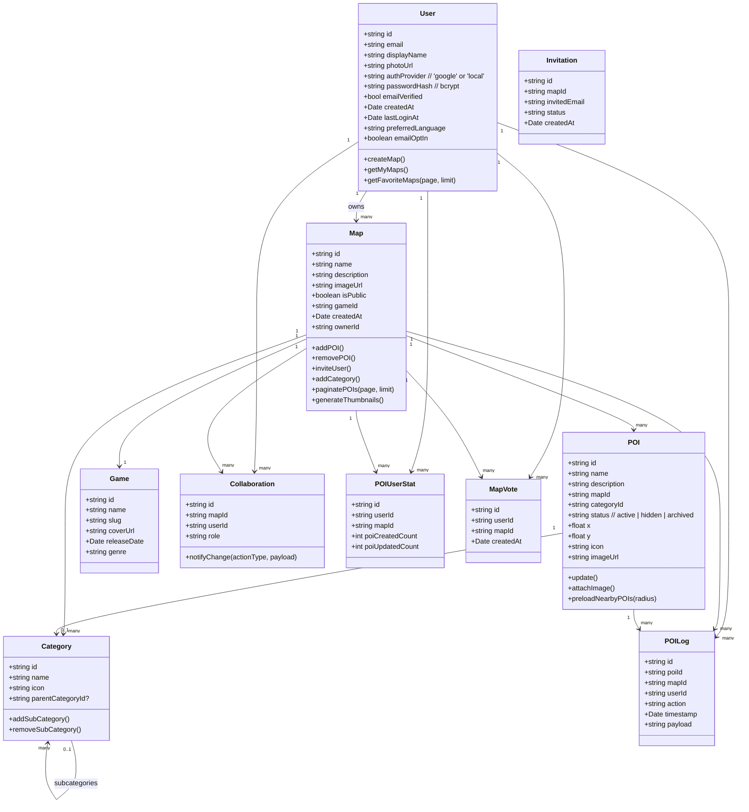

# 🧩 Class Diagram – WayPoint Map Builder (MVP)

This document illustrates the core data entities and their relationships in the MVP version of the WayPoint Map Builder application.

---

## 🌳 Class Diagram

---

## 🔑 Explanation of Classes

- **User**: Represents authenticated users (map creators and collaborators).
- **Map**: Represents an individual map created by a user.
- **POI (Point of Interest)**: Represents markers added to a map.
- **Category**: Organizes POIs into hierarchical categories.
- **Collaboration**: Defines user roles and access permissions.
- **POILog**: Tracks creation and modification actions performed on POIs.
- **POIUserStat**: Aggregates statistics about user actions on POIs.
- **MapVote**: Allows users to upvote their favorite maps.

---

> 💡 **This structure ensures clarity, modularity, and ease of future feature integration, aligning with MVP requirements.**
