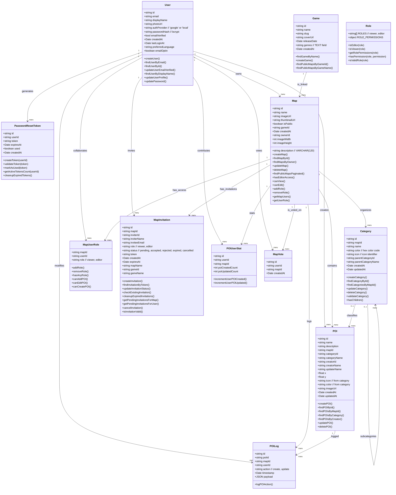

# 🧩 Class Diagram – WayPoint Map Builder (MVP)

This document illustrates the core data entities and their relationships in the MVP version of the WayPoint Map Builder application.

---

## 🌳 Class Diagram

---

## 🔑 Explanation of Classes

- **User**: Represents authenticated users (map creators and collaborators).
- **PasswordResetToken**: Manages password reset tokens with expiration.
- **Map**: Represents an individual map created by a user with dimensions and metadata.
- **POI (Point of Interest)**: Represents markers added to a map with coordinates and category.
- **Category**: Organizes POIs into hierarchical categories with colors and icons.
- **Game**: Represents video games linked to maps with IGDB metadata.
- **MapUserRole**: Defines user roles and access permissions (viewer/editor).
- **MapInvitation**: Manages collaboration invitations with tokens and statuses.
- **POILog**: Tracks all creation and modification actions performed on POIs.
- **POIUserStat**: Aggregates statistics about user contributions.
- **MapVote**: Allows users to upvote their favorite maps.
- **Role**: Utility class for centralized permission management.

---

## 🔄 Changes from Previous Version

### ✅ **Classes Added:**
- **PasswordResetToken**: Secure password reset token management
- **Role**: Centralized permission logic
- **MapInvitation**: Replaces generic `Invitation` class

### 🔧 **Properties Added:**
- **Category**: `color`, `createdAt`, `updatedAt`, `parentCategoryName`
- **POI**: `color`, `updaterName` (from relations)
- **Game**: `createdAt`, `genres` (instead of `genre`)
- **Map**: clarified `description VARCHAR(120)`

### 📋 **Methods Updated:**
- All methods now correspond to actual model exports
- Added validation and permission management methods
- Automatic cleanup methods (expired tokens, invitations)

> 💡 **This structure accurately reflects the real implementation and ensures precise technical documentation for project maintenance and evolution.**
