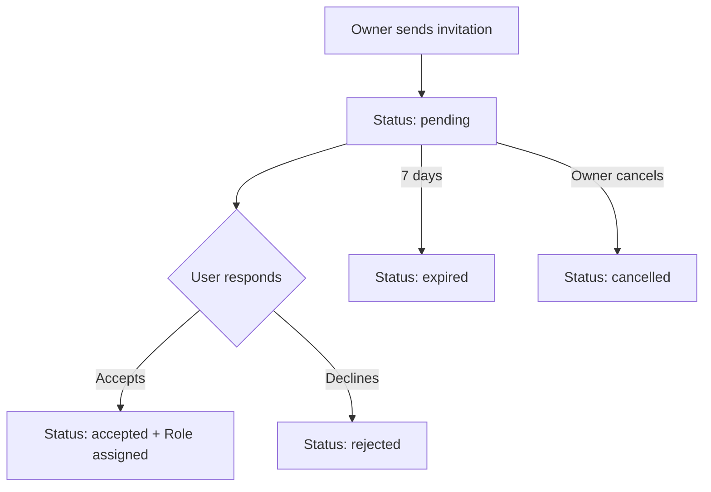

# 🤝 Collaboration System - Waypoint

## Overview

The Waypoint collaboration system allows map owners to invite other users to participate in editing and viewing their maps. This system includes granular role management and permissions, as well as a secure invitation system.

## 🔐 Role System

### Available Roles

| Role | Permissions | Description |
|------|-------------|-------------|
| `owner` | All permissions | Map owner (implicit) |
| `editor` | View, create, edit, delete POIs | Full editing permissions |
| `viewer` | View only | Read-only access |

### Role Relationships

- **`owner`** : Map owner (full control)
- **`editor`** : Can create, modify and delete all POIs on the map
- **`viewer`** : Read-only access

## 📧 Invitation System

### Invitation Lifecycle



### Invitation States

- **`pending`** : Invitation awaiting response
- **`accepted`** : Invitation accepted, role assigned
- **`rejected`** : Invitation declined by invitee
- **`expired`** : Invitation expired (7 days)
- **`cancelled`** : Invitation cancelled by owner

## 🛡️ Security

### Access Controls

1. **Owner verification** : Only the owner can send invitations
2. **Email validation** : Invitation is linked to a specific email
3. **Unique token** : Each invitation has a cryptographically secure token
4. **Automatic expiration** : Invitations expire after 7 days
5. **Duplicate prevention** : Unique constraint on (map_id, email, status)

### Access Control

- **Editors** can view, create, modify and delete all POIs on the map
- **Viewers** have read-only access to all content
- **Owner** has full control including invitation management and role assignment

## 🚀 Performance Optimizations

### Database Indexes

```sql
-- Collaboration query optimization
CREATE INDEX idx_map_user_roles_map_user ON map_user_roles(map_id, user_id);
CREATE INDEX idx_map_user_roles_user_role ON map_user_roles(user_id, role);
CREATE INDEX idx_map_invitations_email_status ON map_invitations(invitee_email, status);
CREATE INDEX idx_map_invitations_token ON map_invitations(token);
CREATE INDEX idx_map_invitations_expires ON map_invitations(expires_at, status);
```

### Performance Constraints

- **Map quota** : Maximum 4 maps per user
- **Automatic cleanup** : Expired invitations automatically removed
- **Permission caching** : Optimized verification checks

## 📊 Monitoring

### Available Information

- Pending invitations via API
- Collaborator status
- Permission query performance

## 🔧 API Endpoints

### Invitation Management

```
POST   /api/backend/maps/:mapId/invitations      # Send invitation
GET    /api/backend/maps/:mapId/invitations      # List invitations
GET    /api/backend/invitations/:token           # Invitation details
POST   /api/backend/invitations/:token/response  # Respond to invitation
DELETE /api/backend/invitations/:id              # Cancel invitation
```

### Role Management

```
GET    /api/backend/maps/:mapId/users            # List users
PUT    /api/backend/maps/:mapId/users/:userId/role # Modify role
DELETE /api/backend/maps/:mapId/users/:userId/role # Remove role
```

## 🧪 Testing

### Test Coverage

- ✅ Invitation tests (creation, response, expiration)
- ✅ Role tests (assignment, transitions, permissions)
- ✅ Security tests (unauthorized access, role verification)

### Running Tests

```bash
cd backend
npm test -- --grep "collaboration|invitation|role"
```

## 🚨 Troubleshooting

### Common Issues

1. **Duplicate invitation error**
   - Check for existing pending invitation
   - Clean up expired invitations

2. **Permission verification issues**
   - Verify role-based access logic
   - Check user role assignment

3. **Slow performance**
   - Verify indexes are created
   - Analyze slow queries

### Database Migration

To apply collaboration improvements:

```bash
node backend/scripts/migrate-collaboration.js
```

## 📚 Usage Examples

### Invite a Collaborator

```javascript
// Client side
const response = await fetch(`/api/backend/maps/${mapId}/invitations`, {
  method: 'POST',
  headers: {
    'Authorization': `Bearer ${token}`,
    'Content-Type': 'application/json'
  },
  body: JSON.stringify({
    email: 'collaborator@example.com',
    role: 'editor'
  })
});
```

### Check Permissions

```javascript
// Server side
const canEdit = await MapModel.canEdit(mapId, userId);
const userRole = await MapModel.getUserRole(mapId, userId);
```
