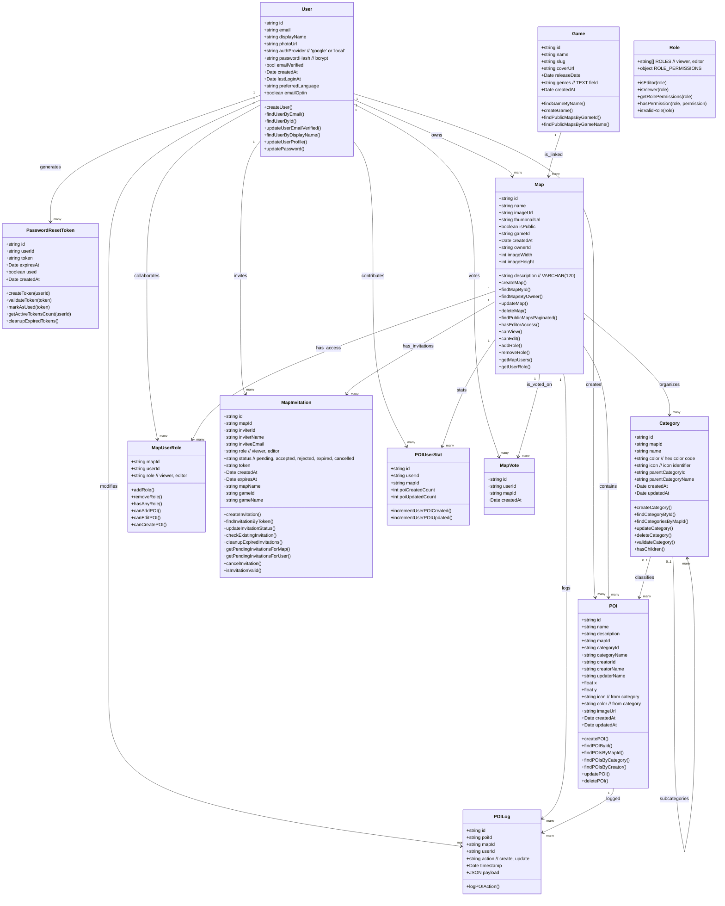

# 🧩 Diagramme de classes – WayPoint Map Builder (MVP)

Ce document présente les principales entités de données et leurs relations dans la version MVP de l'application WayPoint Map Builder.

---

## 🌳 Diagramme de classes

---

## 🔑 Explication des classes

- **User**: représente les utilisateurs authentifiés (créateurs et collaborateurs).
- **PasswordResetToken**: gère les jetons de réinitialisation de mot de passe avec expiration.
- **Map**: représente une carte individuelle créée par un utilisateur avec dimensions et métadonnées.
- **POI (Point of Interest)**: représente les marqueurs ajoutés à une carte avec coordonnées et catégorie.
- **Category**: organise les POI en catégories hiérarchiques avec couleurs et icônes.
- **Game**: représente les jeux vidéo liés aux cartes avec métadonnées IGDB.
- **MapUserRole**: définit les rôles et permissions d'accès des utilisateurs (viewer/editor).
- **MapInvitation**: gère les invitations de collaboration avec tokens et statuts.
- **POILog**: journalise toutes les actions de création et modification sur les POI.
- **POIUserStat**: compile des statistiques sur les contributions utilisateur.
- **MapVote**: permet aux utilisateurs de voter pour leurs cartes favorites.
- **Role**: classe utilitaire pour la gestion centralisée des permissions.

---

## 🔄 Nouveautés par rapport à la version précédente

### ✅ **Classes ajoutées :**
- **PasswordResetToken**: gestion sécurisée des réinitialisations de mot de passe
- **Role**: centralisation de la logique des permissions
- **MapInvitation**: remplace la classe générique `Invitation`

### 🔧 **Propriétés ajoutées :**
- **Category**: `color`, `createdAt`, `updatedAt`, `parentCategoryName`
- **POI**: `color`, `updaterName` (depuis les relations)
- **Game**: `createdAt`, `genres` (au lieu de `genre`)
- **Map**: précision `description VARCHAR(120)`

### 📋 **Méthodes mises à jour :**
- Toutes les méthodes correspondent maintenant aux exports réels des modèles
- Ajout des méthodes de validation et de gestion des permissions
- Méthodes de nettoyage automatique (tokens expirés, invitations)

>💡 **Cette structure reflète fidèlement l'implémentation réelle et garantit une documentation technique précise pour la maintenance et l'évolution du projet.**
