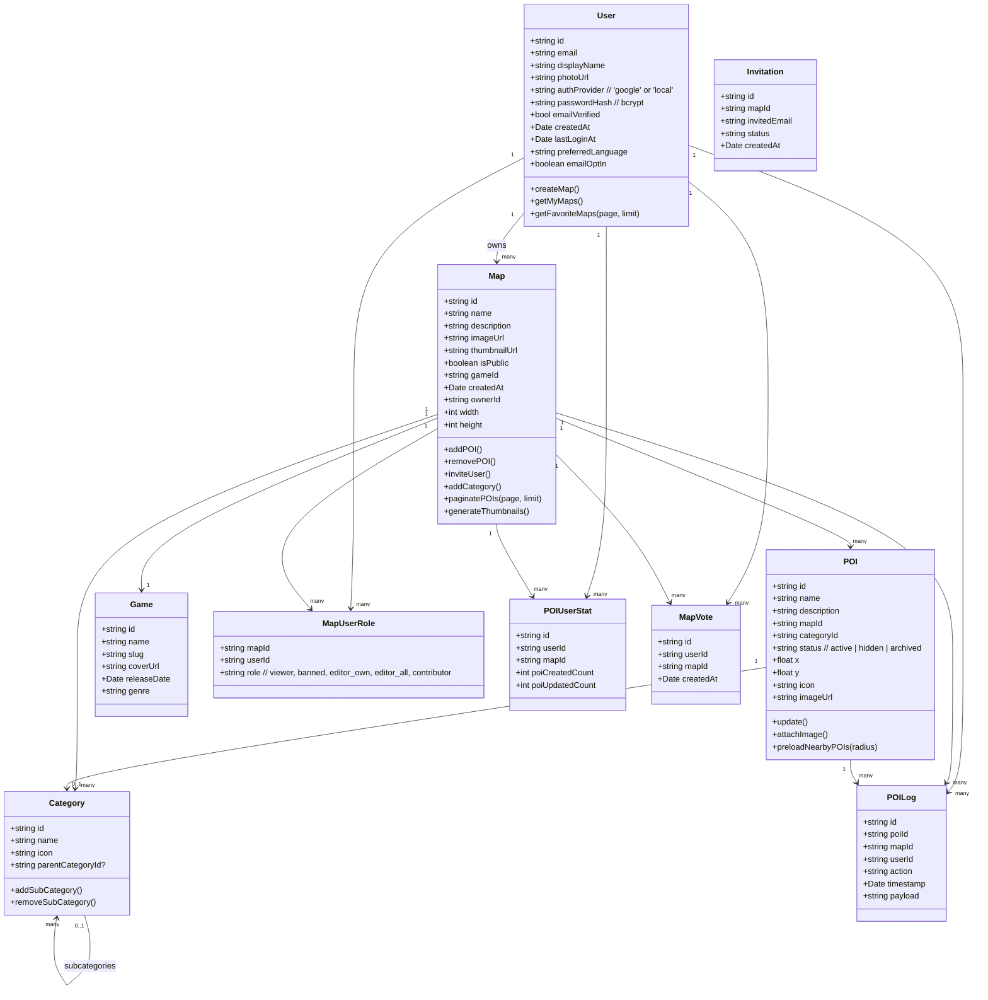

# 🧩 Diagramme de classes – WayPoint Map Builder (MVP)

Ce document présente les principales entités de données et leurs relations dans la version MVP de l'application WayPoint Map Builder.

---

## 🌳 Diagramme de classes

---

## 🔑 Explication des classes

- **User**: représente les utilisateurs authentifiés (créateurs et collaborateurs).
- **Map**: représente une carte individuelle créée par un utilisateur.
- **POI (Point of Interest)**: représente les marqueurs ajoutés à une carte.
- **Category**: organise les POI en catégories hiérarchiques.
- **MapUserRole**: définit les rôles et permissions d'accès des utilisateurs.
- **POILog**: journalise les actions de création et modification effectuées sur les POI.
- **POIUserStat**: compile des statistiques sur les actions utilisateur concernant les POI.
- **MapVote**: permet aux utilisateurs de voter pour leurs cartes favorites.

---

>💡 **Cette structure garantit clarté, modularité et facilité d'intégration des fonctionnalités futures, conformément aux exigences du MVP.**
