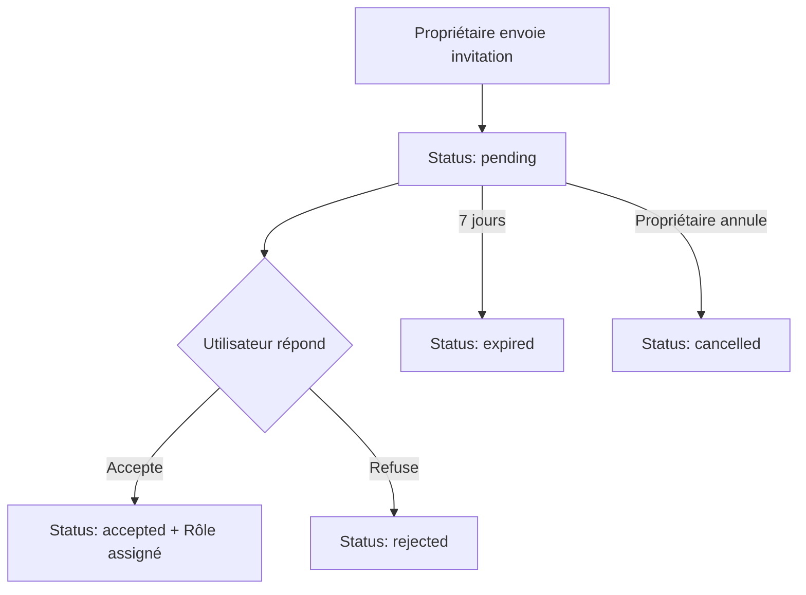

# 🤝 Système de Collaboration - Waypoint

## Vue d'ensemble

Le système de collaboration de Waypoint permet aux propriétaires de cartes d'inviter d'autres utilisateurs à participer à l'édition et à la visualisation de leurs cartes. Ce système comprend une gestion granulaire des rôles et des permissions, ainsi qu'un système d'invitations sécurisé.

## 🔐 Système de Rôles

### Rôles Disponibles

| Rôle | Permissions | Description |
|------|-------------|-------------|
| `owner` | Toutes permissions | Propriétaire de la carte (implicite) |
| `editor` | Voir, créer, modifier, supprimer des POIs | Permissions d'édition complètes |
| `viewer` | Voir uniquement | Accès en lecture seule |

### Relations entre les Rôles

- **`owner`** : Propriétaire (contrôle total)
- **`editor`** : Peut créer, modifier et supprimer tous les POIs sur la carte
- **`viewer`** : Lecture seule

## 📧 Système d'Invitations

### Cycle de Vie d'une Invitation



### États des Invitations

- **`pending`** : Invitation en attente de réponse
- **`accepted`** : Invitation acceptée, rôle assigné
- **`rejected`** : Invitation refusée par l'invité
- **`expired`** : Invitation expirée (7 jours)
- **`cancelled`** : Invitation annulée par le propriétaire

## 🛡️ Sécurité

### Contrôles d'Accès

1. **Vérification du propriétaire** : Seul le propriétaire peut envoyer des invitations
2. **Validation de l'email** : L'invitation est liée à un email spécifique
3. **Token unique** : Chaque invitation a un token cryptographiquement sécurisé
4. **Expiration automatique** : Invitations expirées après 7 jours
5. **Prévention des doublons** : Contrainte unique sur (map_id, email, status)

### Contrôle d'Accès

- **Éditeurs** peuvent voir, créer, modifier et supprimer tous les POIs sur la carte
- **Visualisateurs** ont un accès en lecture seule à tout le contenu
- **Propriétaire** a le contrôle total incluant la gestion des invitations et l'assignation des rôles

## 🚀 Optimisations de Performance

### Index de Base de Données

```sql
-- Optimisation des requêtes de collaboration
CREATE INDEX idx_map_user_roles_map_user ON map_user_roles(map_id, user_id);
CREATE INDEX idx_map_user_roles_user_role ON map_user_roles(user_id, role);
CREATE INDEX idx_map_invitations_email_status ON map_invitations(invitee_email, status);
CREATE INDEX idx_map_invitations_token ON map_invitations(token);
CREATE INDEX idx_map_invitations_expires ON map_invitations(expires_at, status);
```

### Contraintes de Performance

- **Quota de cartes** : Maximum 4 cartes par utilisateur
- **Nettoyage automatique** : Invitations expirées supprimées automatiquement
- **Cache des permissions** : Vérifications optimisées

## 📊 Monitoring

### Informations Disponibles

- Invitations en attente via l'API
- Statut des collaborateurs
- Performances des requêtes de permissions

## 🔧 API Endpoints

### Gestion des Invitations

```
POST   /api/backend/maps/:mapId/invitations      # Envoyer une invitation
GET    /api/backend/maps/:mapId/invitations      # Lister les invitations
GET    /api/backend/invitations/:token           # Détails d'une invitation
POST   /api/backend/invitations/:token/response  # Répondre à une invitation
DELETE /api/backend/invitations/:id              # Annuler une invitation
```

### Gestion des Rôles

```
GET    /api/backend/maps/:mapId/users            # Lister les utilisateurs
PUT    /api/backend/maps/:mapId/users/:userId/role # Modifier un rôle
DELETE /api/backend/maps/:mapId/users/:userId/role # Supprimer un rôle
```

## 🧪 Tests

### Couverture des Tests

- ✅ Tests d'invitations (création, réponse, expiration)
- ✅ Tests de rôles (assignation, transitions, permissions)
- ✅ Tests de sécurité (accès non autorisés, vérification des rôles)

### Exécution des Tests

```bash
cd backend
npm test -- --grep "collaboration|invitation|role"
```

## 🚨 Dépannage

### Problèmes Fréquents

1. **Erreur de doublon d'invitation**
   - Vérifier qu'il n'y a pas déjà une invitation pending
   - Nettoyer les invitations expirées

2. **Problèmes de vérification des permissions**
   - Vérifier la logique d'accès basée sur les rôles
   - Contrôler l'assignation des rôles utilisateur

3. **Performance lente**
   - Vérifier que les index sont créés
   - Analyser les requêtes lentes

### Migration de Base de Données

Pour appliquer les améliorations de collaboration :

```bash
node backend/scripts/migrate-collaboration.js
```

## 📚 Exemples d'Usage

### Inviter un Collaborateur

```javascript
// Côté client
const response = await fetch(`/api/backend/maps/${mapId}/invitations`, {
  method: 'POST',
  headers: {
    'Authorization': `Bearer ${token}`,
    'Content-Type': 'application/json'
  },
  body: JSON.stringify({
    email: 'collaborateur@example.com',
    role: 'editor'
  })
});
```

### Vérifier les Permissions

```javascript
// Côté serveur
const canEdit = await MapModel.canEdit(mapId, userId);
const userRole = await MapModel.getUserRole(mapId, userId);
```
